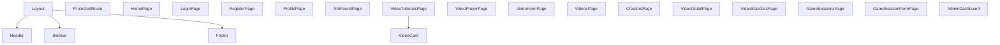

# Component Dependencies

This graph shows the dependencies between components in the application.

```mermaid
graph TD
  Layout["Layout"]
  Header["Header"]
  Sidebar["Sidebar"]
  Footer["Footer"]
  ProtectedRoute["ProtectedRoute"]
  VideoCard["VideoCard"]
  HomePage["HomePage"]
  LoginPage["LoginPage"]
  RegisterPage["RegisterPage"]
  ProfilePage["ProfilePage"]
  NotFoundPage["NotFoundPage"]
  VideoTutorialsPage["VideoTutorialsPage"]
  VideoPlayerPage["VideoPlayerPage"]
  VideoFormPage["VideoFormPage"]
  VideosPage["VideosPage"]
  CreatorsPage["CreatorsPage"]
  VideoDetailPage["VideoDetailPage"]
  VideoStatisticsPage["VideoStatisticsPage"]
  GameSessionsPage["GameSessionsPage"]
  GameSessionFormPage["GameSessionFormPage"]
  AdminDashboard["AdminDashboard"]
  Layout --> Header
  Layout --> Sidebar
  Layout --> Footer
  VideoTutorialsPage --> VideoCard

```